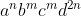

<script type="text/javascript"
        src="https://cdnjs.cloudflare.com/ajax/libs/mathjax/2.7.0/MathJax.js?config=TeX-AMS_CHTML">
</script>

<div style="text-align: justify;">

# **Parcial N1**

**Nombres:** Juan Pablo

**Apellidos:** Herrera RIvero

**Instrucciones:** El parcial es una evaluación estrictamente individual; por lo tanto, durante la realización del mismo, no está permitido prestar o recibir ayuda de otro(s) estudiante(s). Durante el desarrollo del parcial no está permitido el uso de material bibliográfico, ni de dispositivos electrónicos o programables. El estudiante que infrinja alguna de las instrucciones anteriores será retirado del parcial y se le considerará aplazado con la nota mínima. El parcial tiene una duración estimada de 90 minutos

1. A continuación se presentan cuatro (04) preguntas de selección simple. Para cada pregunta, marque con una X encima de la opción que usted considere correcta. Toda pregunta tiene una respuesta única. Una respuesta correcta vale 1 punto, una respuesta incorrecta restará la mitad de una correcta, una pregunta no contestada no suma ni resta puntos. Si usted selecciona más de una opción, la pregunta se considerará respondida incorrectamente. Si no está completamente seguro(a) de la respuesta de una pregunta, es recomendable que no la conteste. (Valor: **4 puntos**)

    Sea el alfabeto Σ = {a, b} y considere la expresión regular **(a∗ ∪ bb ∪ ba)∗aba(ab ∪ ba)b∗**

   * ¿Cuál de las siguientes frases no está incluida en el lenguaje denotado por la expresión regular?

      1. abaaabaabaabb
      2. abaabbbabaabb
      3. baaabbaabaabbb
      4. abaabaabaabaabb 
        <div style="text-align: right">La respuesta es: <strong>2</strong></div>

    <br>

   * Durante la traducción o interpretación de un lenguaje de programación, el analizador léxico toma una secuencia de caracteres que representa un programa **y**:
  
      1. La traduce a un nuevo lenguaje.
      2. Construye el árbol sintáctico abstracto.
      3. La convierte en una secuencia de tokens.
      4. Decide si el lenguaje que representa es regular.
        <div style="text-align: right">La respuesta es: <strong>3</strong></div>

    <br>

   * ¿Cuándo no se puede afirmar que un lenguaje **L** es regular?
  
      1. Cuando es reconocido por un autómata finito determinístico.
      2. Cuando es reconocido por un autómata finito no determinístico.
      3. Cuando es representado por una expresión regular.
      4. Cuando es generado por una gramática.
        <div style="text-align: right">La respuesta es: <strong>4</strong></div>

    <br>

   * Considere una gramática regular **G = (V, T, P, S)** donde todas las producciones en **P** son de la forma **A → xB**, con **A ∈ V** , **x ∈ T, B ∈ (V ∪ ϵ)**. ¿En cuántos pasos de derivación genera **G**, una palabra de longitud **n** que pertenezca a **L(G)**?

      1. n
      2. n + 1
      3. Depende de la palabra.
      4. Depende de la presencia o falta de símbolos recursivos (directa o indirectamente).
        <div style="text-align: right">La respuesta es: <strong></strong></div>

    <br>
    <br>

2. Considere el alfabeto Σ = {a, b}. Diseñe un autómata finito determinístico (AFD) M tal que reconozca el lenguaje: 

   **L = {w ∈ Σ∗: w contiene exactamente dos a y una cantidad impar de b}**

    Dibuje el diagrama de estados para **M**. Su respuesta solo se considerará correcta si el **AFD M** que usted dise˜ne satisface que **L(M) = L**. (Valor: **4 puntos**)

    ```mermaid
    flowchart LR
        id{e0}-->|a|e3;
        id{e0}-->|b|e1;

        e1-->|a|e4;
        e1-->|b|e2;
        
        e2-->|b|e1;
        e2-->|a|e3;

        e3-->|a|e5;
        e3-->|b|e4;

        e4-->|a|e6;
        e4-->|b|e3;

        e5-->|b|e6;
        e5-->|a|e7;

        e6-->|a|e7;
        e6-->|b|e5;

        e7-->|a,b|e7;

        subgraph FINAL
        e6
        end
    ```

    **Nota:** Por limitaciones sintácticas de **Mermaid**, se utilizó un **rombo** para indicar que es el **estado inicial** (cuando se debería usar una flecha que parte de la nada), y para el **estado final** se usó un **cuadro** que lo encierra para destacarlo.

    <br>
    <br>

3. Considere el alfabeto **Σ = {a, b}**. Diseñe un autómata finito no determinístico (**AFND**) **M** tal que reconozca el lenguaje **L = {w ∈ Σ∗: |w| es impar y w contiene al menos dos b}**

    Dibuje el diagrama de estados para M. Su respuesta sólo se considerará correcta si el AFND M que usted dise˜ne satisface que L(M) = L. (Valor: 4 puntos)


    ```mermaid
    flowchart LR
        id{e0}-->|a|e1;
        id{e0}-->|b|e2;

        e2-->|a|e3
        e2-->|b|e4

        e4-->|a,b|e5

        e1-->|a|id{e0}
        e1-->|b|e3

        e3-->|a|e2
        e3-->|b|e5

        e5-->|a|e3
        e5-->|a,b|e4

        subgraph FINAL
        e5
        end
        
    ```

    **Nota:** Por limitaciones sintácticas de **Mermaid**, se utilizó un **rombo** para indicar que es el **estado inicial** (cuando se debería usar una flecha que parte de la nada), y para el **estado final** se usó un **cuadro** que lo encierra para destacarlo.

    <br>
    <br>

4. Considere el alfabeto **Σ = {a, b}**. Diseñe una expresión regular (**ER**) **r** tal que describa el lenguaje 

    **L = {w ∈ Σ∗: w comienza con ba, termina con ab y contiene el substring aa}**

    Su respuesta sólo se considerará correcta si la ER r que usted diseñe satisface que **L(r) = L**. (Valor: **4 puntos**)

    ```regex
    (baΣ*aaΣ*ab)∪(baΣ*aab)∪(baaΣ*ab)∪(baab)
        
    ```

    <br>
    <br>

5. Considere la gramática libre de contexto **G1 = (V1, T1, P1, S)**, donde:

    **V1 = {S, A}**

    **T1 = {a, b, c, d}**

    **P1 = {S → aSdd, S → A, A → bAc, A → bc}**

    1. Indique el lenguaje generado por G1. (Valor: 2 puntos)

        **n ∈ ℕ - {0}**

        **m ∈ ℕ - {0}**

        Se sigue la estructura:

        

    2. Desarrolle paso a paso la derivación por la izquierda para el string aaabbbcccdddddd en G1. Indique, en cada paso de la derivación, la producción utilizada. (Valor: 1 punto)

        |       Estado         |      Paso      |
        |----------------------|----------------|
        | S→S                  |      N/A       |
        | S→aSdd               |     S→aSdd     |
        | S→aaSdddd            |     S→aSdd     |
        | S→aaaSdddddd         |     S→aSdd     |
        | S→aaaAdddddd         |      S→A       |
        | S→aaabAcdddddd       |     A→bAc      |
        | S→aaabbAccdddddd     |     A→bAc      |
        | S→aaabbbcccdddddd    |      A→bc      |

    3. Construya el árbol de derivación para el string aaabbbcccdddddd en G1.(Valor: 1 punto)


        ```mermaid
        graph TD

            subgraph N0
                i(S)
            end

            subgraph N1
                i(S)-->3(a)
                i(S)-->2(S)
                i(S)-->4(bb)
            end
            subgraph N2
                2(S)-->5(a)
                2(S)-->7(S)
                2(S)-->6(bb)
            end

            subgraph N3
                7(S)-->9(a)
                7(S)-->8(S)
                7(S)-->10(bb)
            end
            
            
            subgraph N4
                8(S)-->11(A)
            end

            subgraph N5
                11(A)-->13(b)
                11(A)-->12(A)
                11(A)-->14(c)
            end
            
            subgraph N6
                12(A)-->16(b)
                12(A)-->15(A)
                12(A)-->17(c)
            end

            subgraph N7
                15(A)-->18(bc)
            end
        ```

</div>
